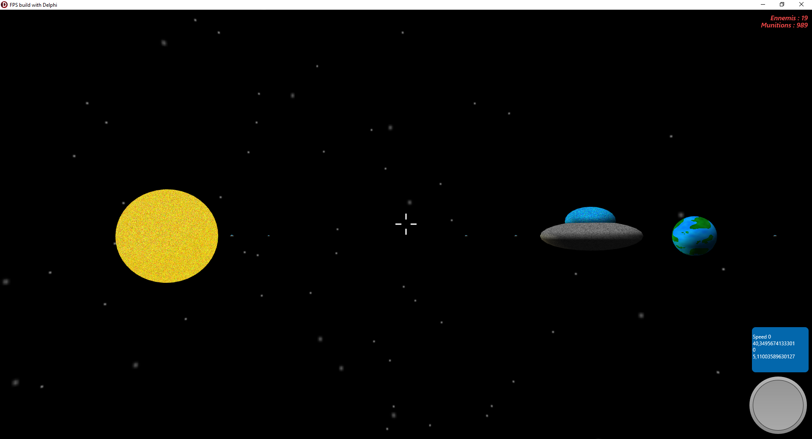

# SSDE

This project is my participation in Ludum Dare 57

You need to install my GBE3D components suite (https://github.com/gbegreg/GBE3D) to compile this project.

The games is under development ;)
 

